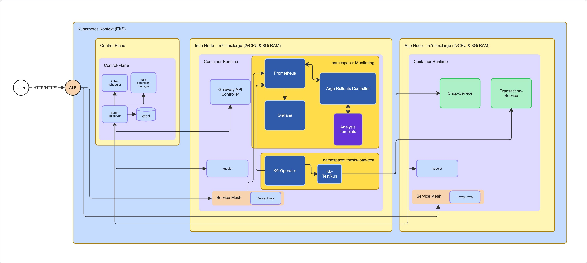
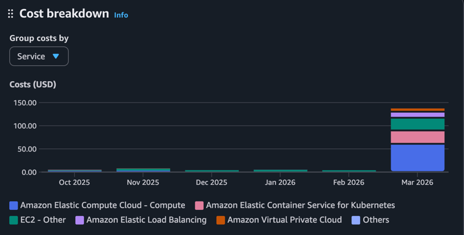

Bachelorthesis-zdd-k8s
============================== 

## Forschungsfrage

    Wie verringern SLO gesteuerte Canary Releases den Error Budget Verbrauch im Vergleich zu Rolling Updates?

## Szenario

    Rolling Updates haben keine Form der analytischen Überprüfung im Hinblick auf SLO-Verletzungen, deshalb wurde mithilfe vom Grafana Alertmanager die Überwachung des Deployments realisiert.   
    Für Canary Releases wurde mithilfe von Analysistemplates ein vergleichbares Szenario, im Hinblick auf Überprüfungsintervalle und Messmetrik erstellt. Da der Vorteil von Canary Releases gegenüber Rolling Updates jedoch darin besteht, 
    eine dedizierte Analyse der neuen Softwareversion vorzunehmen, wurde ein weiteres Szenario analysiert, das mithilfe von AnalysisTemplates speziell die SLO-Verletzungen der Canary Version überprüft.  

Zur Durchführung und den Testszenarien geht es [hier](eks/kustomize/overlays/Testszenarien.md)

## Tech-Stack:
- [EKS](https://aws.amazon.com/eks/) : [K8s](https://kubernetes.io/) + Helm - v1.35
- [K6](https://grafana.com/docs/k6/latest/) - 1.3.0
- [Prometheus](https://prometheus.io/) - v0.89.0
- [Grafana](https://grafana.com/grafana/)
- [Argo Rollouts](https://argoproj.github.io/rollouts/) - v1.8.4
- [Kotlin](https://kotlinlang.org/) - 2.3.0 : [Ktor](https://ktor.io/) - v3.4.0
- Cilium (https://cilium.io/) - 1.18.6

## Architecture

## Cost-Overview

Diese Arbeit ist während der initialen 6 Monate AWS Free-Tier entstanden.

| Datum   | Uhrzeit          | Betrag  | Differenz zum Vorwert |   |
|---------|------------------|---------|-----------------------|---|
| 07.03.  | 08:33            | 132.86$ |                       |   |
| 07.03.  | 12:47            | 118.66$ | -8.50$                |   |
| 08.03.  | 12:47            | 118.66$ | -5.70$                |   |
| 09.03.  | 01:47            | 112.44$ | -6.22$                |   | 
| 09.03.  | 11:12            | 106.10$ | -6.34$                |   |
| 09.03.  | 23:27            | 100.00$ | -6.10$                |   |
| 11.03.  | 13:46            | 80.00$  | -20.00$               |   |
| 12.03.  | 09:43            | 73.68$  | -6.32$                |   |
| 12.03.  | 15:29            | 67.64$  | -6.05$                |   |
| 13.03.  | 09:27            | 60.00$  | -7.63$                |   |
| 13.03.  | 09:27            | 60.00$  | -7.63$                |   |
| 13.03.  | 12:13            | 56.73$  | -3.27$                |   |
| 14.03.  | 08:25            | 51.43$  | -5.30$                |   |
| 14.03.  | 14:25            | 43.33$  | -8.10$                |   |
| 14.03.  | 18:00            | 40.00$  | -3.33$                |   |
| 14.03.  | 19:52            | 39.74$  | -0.26$                |   |
| 15.03.  | 04:19            | 34.91$  | -4.83$                |   |
| 15.03.  | 12:01            | 30.63$  | -4.28$                |   |
| Gesamt: | 8 Tage 7Stunden  |         | -102.23$              |   |

### Cost Analyze by Service
